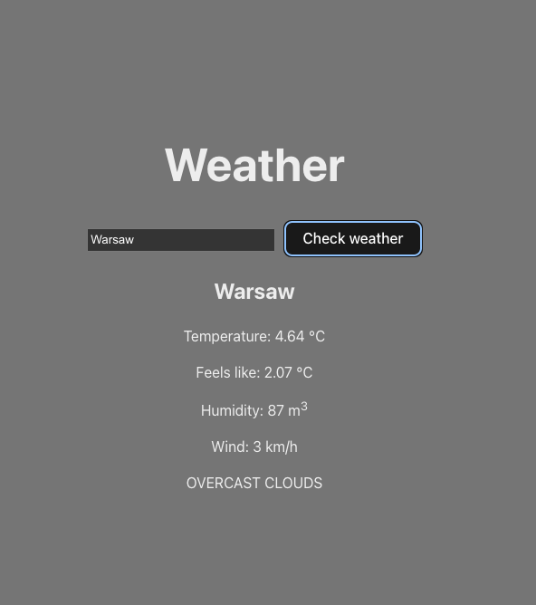

# Weather App

A simple, clean weather application built with HTML, CSS, and JavaScript that allows users to check current weather conditions for any location.

## Features

- Search for weather by city name
- Display current temperature, weather conditions, and location
- Visual representation of weather conditions
- Responsive design for all devices

## Technologies Used

- HTML5
- CSS3
- JavaScript (ES6+)
- OpenWeatherMap API for weather data

## Project Structure
weather-app/
├── css/              # Stylesheet files
│   └── style.css     # Main CSS file
├── js/               # JavaScript files
│   └── script.js     # Main JS functionality
├── index.html        # Main HTML file
└── README.md         # Project documentation
Copy
## How It Works

1. Enter a city name in the search box
2. Click the search button or press Enter
3. The app fetches weather data from OpenWeatherMap API
4. Weather information is displayed including:
   - City name 
   - Current temperature
   - Weather description
   - Weather icon

## Setup and Usage

1. Clone the repository:
git clone https://github.com/Pacholekk/weather-app.git
Copy
2. Open `index.html` in your browser or set up a simple server

3. To use the weather functionality, you'll need to:
- Register for a free API key at [OpenWeatherMap](https://openweathermap.org/api)
- Add your API key to the script.js file

## Screenshots

## Future Enhancements

- Weather forecast for upcoming days
- Display additional weather data (humidity, wind speed, etc.)
- Geolocation to get weather for user's current location
- Save favorite locations

## License

This project is licensed under the MIT License - see the [LICENSE](LICENSE) file for details.

## Contact

Patryk Pacholski - [GitHub](https://github.com/Pacholekk)
